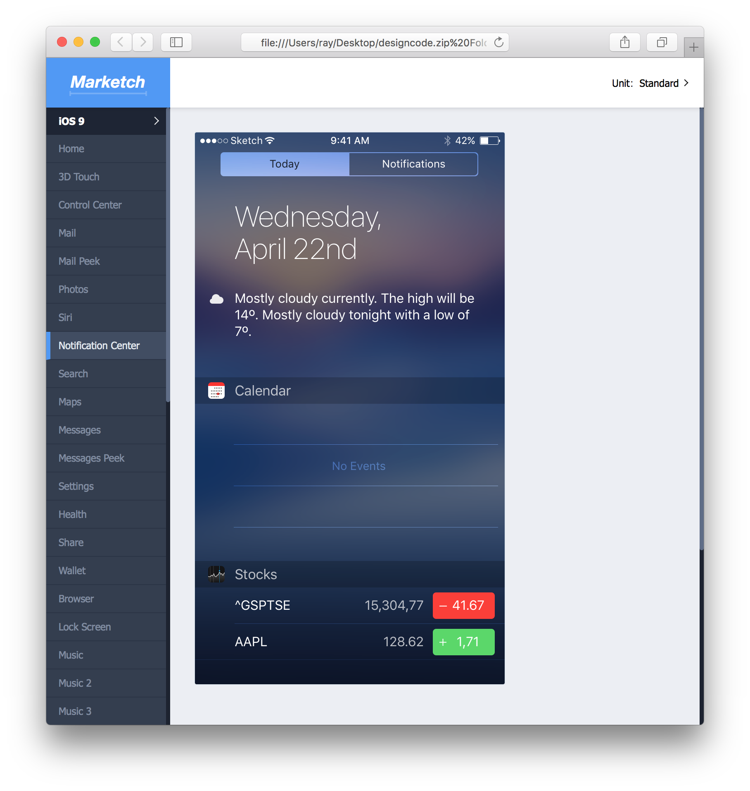
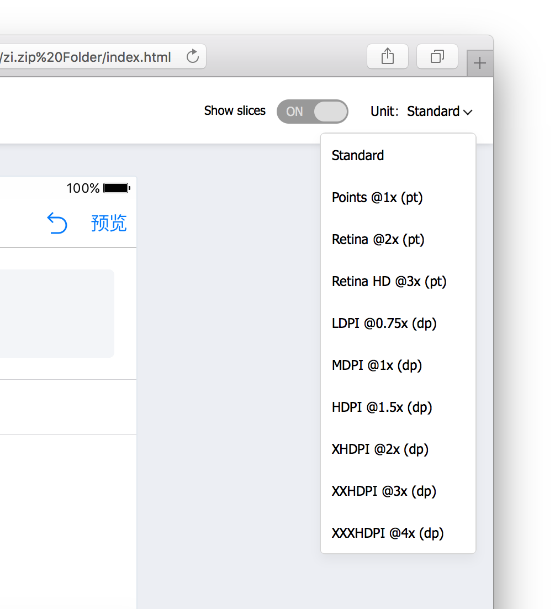
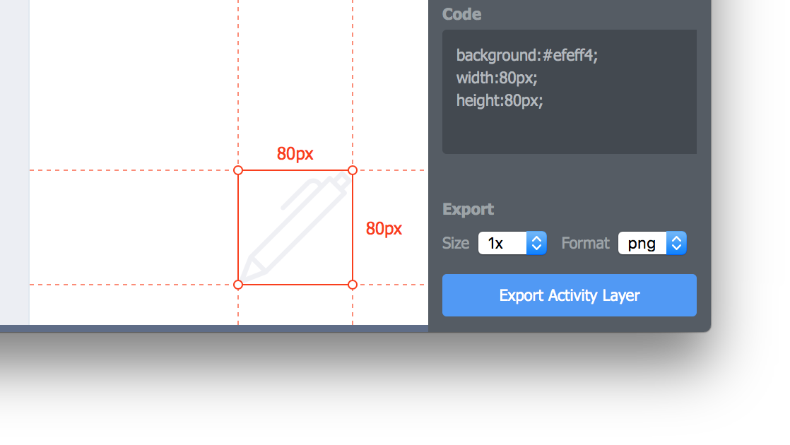
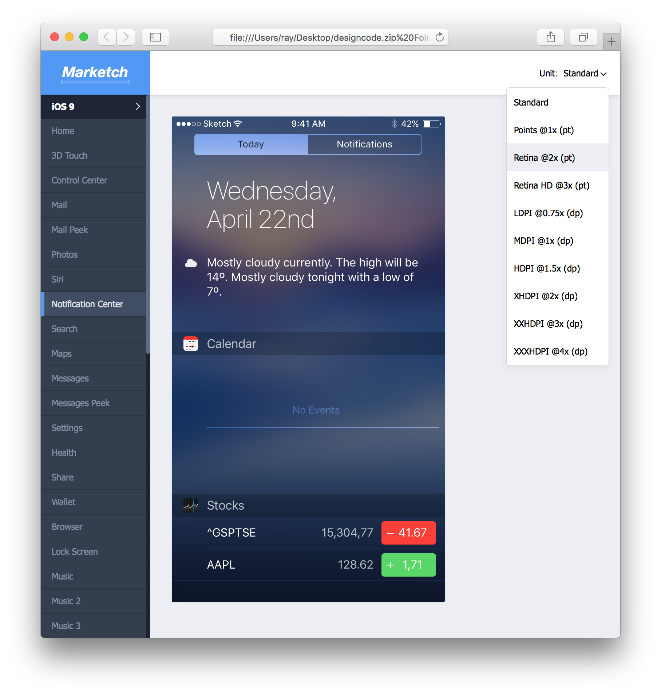

# Marketch

Marketch is a Sketch plugin which helps you generate html page from Sketch file, which you can get measures and CSS styles.

## Notice

* This plugin requires artboard to work.

## Preview

## Demo

[http://tudou527.github.io/marketch/](http://tudou527.github.io/marketch/)

## Usage

* Select pages and artboards in the upper left corner.
* Select an element to view its location and CSS styles on the right side of the page.
* Select an element and hover another to see the spacing between them. 

## Contribute

The plugin is in active development, any help would be appreciated.

If you believe you have found a bug, please open an issud according to [this template](issue-template.md).

If you want to contribute to our code base, here's a [contribution guide](contribution.md). Feel free to open a pull request.

## Thanks

* [MForever78](https://github.com/MForever78)
* [noyobo](https://github.com/noyobo)
* [xunuo](https://github.com/xunuo)
* [rayps](https://github.com/rayps)
