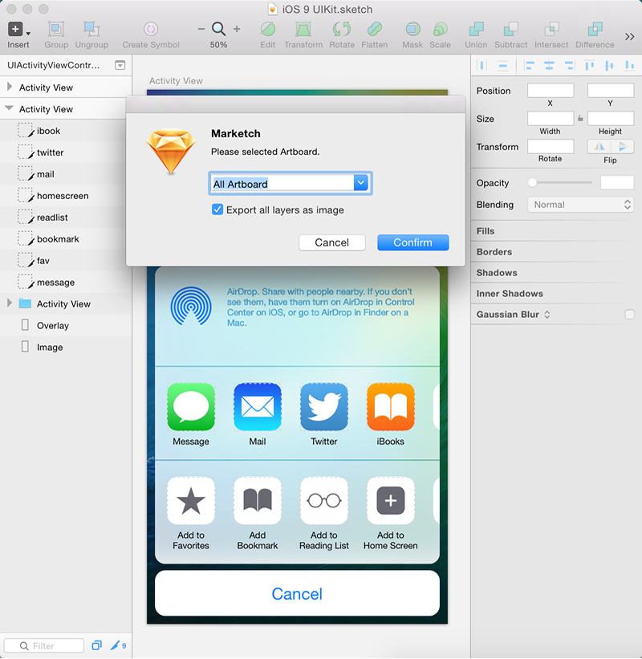

# Marketch

Marketch is a Sketch 3 plug-in for automatically generating html page that can measure and get CSS styles on it.

## Change Log

#### `v1.0.0`
* [add] supports export slice.
* [add] css attribute support multiple radius.
* [update] keep the export css arrtibute consistent with sketch.
* [fixed] artboard screenshots of abnormal.

Notice
* This plugin works for latest Sketch(Version 3.3.2).
* It does not work without artboard using.

## Preview

## Demo
[http://tudou527.github.io/marketch/](http://tudou527.github.io/marketch/)

## Using the Plugin
* Select pages and artboards in the upper left corner
* Select an element to view its location and CSS styles on the right side of the page.
* Select an element and hover another to see the spacing between them. 

## Contribute

The plugin is in active develop, any help would be appreciated.

If you believe you have found a bug, please open an issud according to [this template](issue-template.md).

If you want to contribute to our code base, here's a [contribution guide](contribution.md). Feel free to open a pull request.

## Thanks
* [MForever78](https://github.com/MForever78)
* [noyobo](https://github.com/noyobo)
* 许诺
