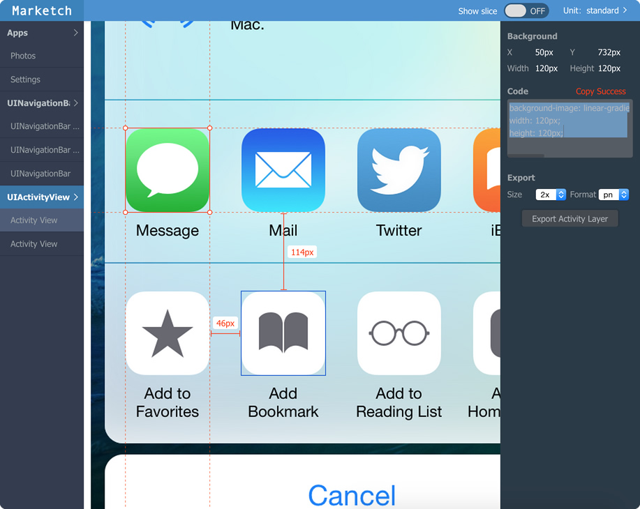

# Issue template

To help you and us target the bug efficiently, we urge you to provide these essential information.

## Example

- Sketch version: 3.3.2(12043)
- Description: The value should be... but I see...
- Screenshot: 

